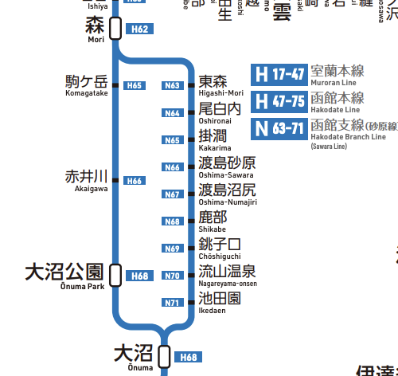

# JRの最長経路を出すためのプログラム

* (現在書き換え作業中)

## 1. はじめに

このスクリプトはJRの旅客営業規則に基づき、最も長い経路を算出するためのスクリプトです。

スクリプトには、経路を算出する"read_root.py"と全駅データから計算用のデータを作成する"*railway_data_create.py"があります。

最低限必要な計算用データを"graphillion_data"ディレクトリに格納してあります。

JR全線(貨物専用線を除く)の全駅間データは"all_line_data"ディレクトリに格納しています。

## 2. 全駅間データの書式について

全駅間データの書式は次の通りです

| 駅名1 | 駅名2 | 駅間距離(実キロ) | 路線名 |
|:---:|:---:|---:|:---:|
| 東京 | 有楽町 | 0.8 | 東海道 |

このうち路線名はスクリプト内では使用しませんが、整理用に付ける事を推奨します。

こちらで用意した全駅間データの路線名と記述順は「鉄道要覧」に沿って記述しています。


## 3. *railway_data_create.pyの使い方について

現在、計算プログラムはメモリの都合上、北海道ブロック、本州ブロック、九州ブロックと3分割して計算しています。

現在、考えられるパターンは以下の二つです。

* 北海道発九州着

* 九州発北海道着

よって、"start_railway_data_create.py"および"end_railway_data_create.py"に北海道と九州のデータを、
"railway_data_create.py"に本州のデータを入れます。

### 全プログラム共通の機能


全駅データを読み込み、駅の登場回数をdict形式で保存します。登場回数によって、3つに分類されます。

* 1回 路線の起終点となる駅

* 2回 単一路線のみが乗り入れる駅

* それ以外 複数路線が乗り入れる分岐駅

2回しか出てこない駅は、計算量削減のため、前後の駅と区間を合算します。

```
stop_station_list = # 分岐駅では無いが、路線名が途中で変わる駅(神戸・金沢等)や、強制的に分割したい駅を入れる
```

上記には、分割したい任意駅をlist形式で入れる事が出来ます。ただし、
ルート上の都合により上記のオプションを使用せざるを得ない区間が複数存在します。

* 営業キロ数は異なるが同じ2地点間を結ぶ場合

途中での経由地の違いにより、営業キロ数は異なるものの、途中に分岐駅を挟まないため違うキロ数にも関わらず、同じ2地点間を結ぶ場合があります。
Graphillionの仕様上、距離が違っても同じ2地点間を2つ以上読み込むことは出来ません。よってこの場合には、
任意の途中駅を1ヶ所指定して重複を避ける必要があります。

路線図出典:[ひまわりデザイン研究所](https://www.47rail.jp/)

* ケース1　大沼〜森間(函館本線、函館本線(砂原線))(北海道)



大沼〜森間は大沼公園経由の本線と東森経由の砂原線の2ルートがあります。どちらのルートも分岐駅がないためエラーとなります。
このためどちらかのルートのうち、1駅を強制分割の対象とする必要があります。作者は砂原線の東森駅を対象としました。

* ケース2　一ノ関〜北上間(東北本線、東北新幹線)(本州)


一ノ関〜北上間は平泉・水沢経由の東北本線と水沢江刺経由の東北新幹線の2ルートがあります。どちらのルートも分岐駅がないためエラーとなります。
このためどちらかのルートのうち、1駅を強制分割の対象とする必要があります。作者は東北新幹線の水沢江刺駅を対象としました。


* ケース3　横浜〜大船間(東海道本線(JT)、根岸線(JK))(本州)


横浜〜大船間は戸塚経由の東海道本線(JT)と桜木町・磯子経由の根岸線の2ルートがあります。どちらのルートも分岐駅がないためエラーとなります。
このためどちらかのルートのうち、1駅を強制分割の対象とする必要があります。作者は根岸線の桜木町駅を対象としました。

* ケース4　相生〜東岡山間(山陽本線(A、S)、赤穂線(A、N))(本州)


相生〜東岡山間は上郡経由の山陽本線(A(神戸方面から上郡まで)、S(上郡から岡山まで))と播州赤穂経由の赤穂線(A(相生から播州赤穂まで)、
N(播州赤穂から岡山まで))の2ルートがあります。どちらのルートも分岐駅がないためエラーとなります。このためどちらかのルートのうち、
1駅を強制分割の対象とする必要があります。作者は運行上の区切りとなる赤穂線の播州赤穂駅を対象としました。

* ケース5　福山〜三原間(山陽本線(X、G)、山陽新幹線)(本州)


福山〜三原間は尾道経由の山陽本線(X(福山から糸崎まで)、G(糸崎から広島まで))と新尾道経由の山陽新幹線の2ルートがあります。
どちらのルートも分岐駅がないためエラーとなります。このためどちらかのルートのうち、1駅を強制分割の対象とする必要があります。
作者は山陽新幹線の新尾道駅を対象としました。


* ケース6　三原〜海田市間(山陽本線(G)、呉線(Y))(本州)


三原〜海田市間は西条経由の山陽本線(G)と呉経由の呉線(Y)の2ルートがあります。どちらのルートも分岐駅がないためエラーとなります。
このためどちらかのルートのうち、1駅を強制分割の対象とする必要があります。作者は運行上の区切りとなる呉線の呉駅を対象としました。

* ケース7 岩国〜櫛ケ浜間(山陽本線、岩徳線)(本州)


岩国〜櫛ケ浜間は柳井・下松経由の山陽本線と西岩国経由の岩徳線の2ルートがあります。どちらのルートも分岐駅がないためエラーとなります。
このためどちらかのルートのうち、1駅を強制分割の対象とする必要があります。作者は岩徳線の西岩国駅を対象としました。


* 2路線だけの起終点になっている駅(設定推奨)

2路線だけの起終点でほかに分岐が無い駅は、登場回数が2回となりますが路線名が変わるため見やすさのために、強制分割の対象とするのを推奨します。
ただ、強制分割の設定をしなくても動作に影響はありません。推奨する駅は以下の通りです。

* 網走駅(釧網本線と石北本線)(北海道)

* 青森駅(奥羽本線と津軽線)(本州)

* 安房鴨川駅(内房線と外房線)(本州)

* 篠ノ井駅(信越本線と篠ノ井線)(本州)

* 金沢駅(北陸本線と北陸新幹線)(本州) ※北陸新幹線敦賀延伸までの暫定措置

* 神戸駅(東海道本線と山陽本線)(本州)

* 東舞鶴駅(舞鶴線と小浜線)(本州)

* 八代駅(鹿児島本線と肥薩線)(九州)

* 川内駅(鹿児島県)(鹿児島本線と九州新幹線)(九州) ※岩手県の川内駅と区別するために、全線データには(鹿)川内と表記しています。

* 鹿児島駅(鹿児島本線と日豊本線)(九州)


(以下作業前の状態)

all_line_data JR全線全駅の駅間データを格納(2020年3月ダイヤ改正・5月札沼線部分廃線対応)

graphillion_data 上記のデータからgraphillion解析用に生成したデータ

root_analysis.py 計算プログラム本体

read_root.py 駅名をid変換する(メモリー削減目的)

railway_data_create.py 通常の路線生成プログラム

start_railway_data_create.py 開始地点を含む路線生成プログラム

end_railway_data_create.py 終端地点を含む路線生成プログラム


GCP Comute Engine n1-highmem-96（96 vCPU、メモリ 624 GB）で動作検証済

※ (2019/12/11現在、九州の路線データのみ上記でもメモリ不足で計算出来ず…)

 無改変での第三者への配布はおやめ下さい